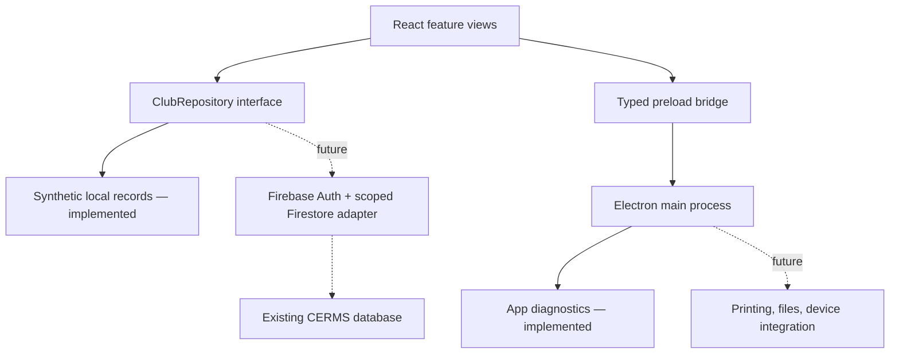

# CERMS 5 skeleton architecture

**Membership update:** The original skeleton design below has now been extended with a separate read-only membership reader, in-memory Firebase Auth session, and desktop network guard. See [Memberships — read-only connection](MEMBERSHIP-READONLY.md) for current behavior and protections. Other modules still use the demo repository. No database migration or writes were added.

The goal is to replace the desktop implementation while keeping the existing Firebase project, default database, Auth identities, collection names, document IDs, field representations, and Storage references. No data migration or schema rewrite is part of this skeleton.

## Boundaries

- **React renderer:** navigation, presentation, view state, loading/error handling. Feature modules are separate and lazy-loaded. There is no `require`, Node integration, generic IPC API, remote CDN JavaScript, or raw record HTML rendering.
- **Repository boundary:** data operations independent of the component tree. The current implementation is deliberately demo-only. Its offset paging is an in-memory fixture convenience; a live implementation should introduce opaque Firestore cursors and indexed queries, not reuse offsets or download all members.
- **Legacy adapters:** translate existing record shapes into named view models. They check `access`, distinguish Firestore timestamps from Unix seconds, preserve human member numbers separately from document IDs, handle legacy notes, and decode rental tuples. These are **read models**. They omit unknown/private fields and must never be written back over complete documents.
- **Preload:** one named method (`getAppInfo`) exposed through `contextBridge`. Future methods must have narrow argument/result types and runtime validation; arbitrary channel names and arbitrary filesystem paths are not acceptable public APIs.
- **Electron main:** creates the window, serves bundled resources over `cerms://app`, validates the IPC sender/main frame, denies new windows/navigation/device permissions by default. Separate `CERMS-5` local profile and app ID allow coexistence with the old app.

## Database integration, later

1. Reauthenticate the Firebase CLI and inspect the existing default database's edition, deployed security rules and indexes. No new database is needed. The old source uses the document/query SDK; production edition has not been independently confirmed.
2. Use the existing email/password provider and Auth users. Load `users/{uid}` and derive club access from that profile. Missing/deactivated user profiles must fail closed. Do not ask users to freely choose tenant IDs and treat that as authorization.
3. Start with read-only membership queries. Validate club access in server rules as well as adapters, and verify permissions against existing profiles. Avoid returning the entire `system` record to the UI, especially its integration token fields.
4. Keep a session-scoped repository/cache, unsubscribe on route/session changes, and clear member data on logout. Store no passwords, Auth tokens, member records, or government IDs in UI preferences/logs. The current skeleton has no Auth session or persistent record cache.
5. Before writes, add explicit operation-specific commands and payload validation. Preserve all unrelated legacy fields, tuple positions, types, sentinel values, and Storage paths. Use field patches rather than replacing normalized documents.
6. Test against an emulator or isolated fixtures/export. No seeding or development writes into the live database. Run contract tests covering existing reports and old-client reads before introducing new features.

Client-side scoping is defense in depth, **not** an alternative to Firestore/Storage rules. This skeleton does not claim to have audited or fixed deployed authorization.

## Efficiency goals

React alone will not fix database costs or checkout reliability. The important next changes are bounded indexed queries, deliberate listener lifetimes, deduplicated member/product lookups, explicit ordering, and transactions/idempotency for business operations. Historical tables should use cursor pagination; active admissions may justify a small real-time subscription. Reporting should avoid doing heavy work on the Electron UI/main event loop. Measure startup duration, memory, reads per session, and checkout latency against CERMS 4 before claiming an improvement.

Financial calculations should use decimal-safe arithmetic or integer cents internally, while preserving the existing dollar-valued database contract. Returning new record shapes directly to old consumers would break compatibility.

## Tooling decisions

- Electron **44.4.1** was verified as latest stable on September 16, 2026 using the [official release list](https://releases.electronjs.org/) and npm registry. React **19.3.0** was resolved from npm.
- electron-vite **5.0.0** supports Vite 5/6/7, so this project uses Vite **7.3.6** and React plugin **5.2.0**. Vite 8 was excluded because it is outside that peer range; dependencies were not forced past compatibility checks.
- Follow [Electron security guidance](https://www.electronjs.org/docs/latest/tutorial/security) for isolation, sandboxing, sender validation, navigation and permission restrictions. Dev CSP allows the local HMR connection; production CSP excludes it.
- Use a single npm lockfile. `npm ci` reproduces the resolved toolchain. TypeScript checks and compatibility tests run independently of launching the desktop.
- electron-builder is the one packaging path. Packaging scripts explicitly use `--publish never`. App signing, notarization, production icons, updates, and CI release automation remain future work.

## Deliberately excluded

Production Firebase configuration, sign-in, migrations, writes, checkout, printing, accounting, uploads, signing hardware, automatic updates, background jobs, and operational analytics. Their navigation slots and legacy requirements are documented; their workflows are not implemented.
