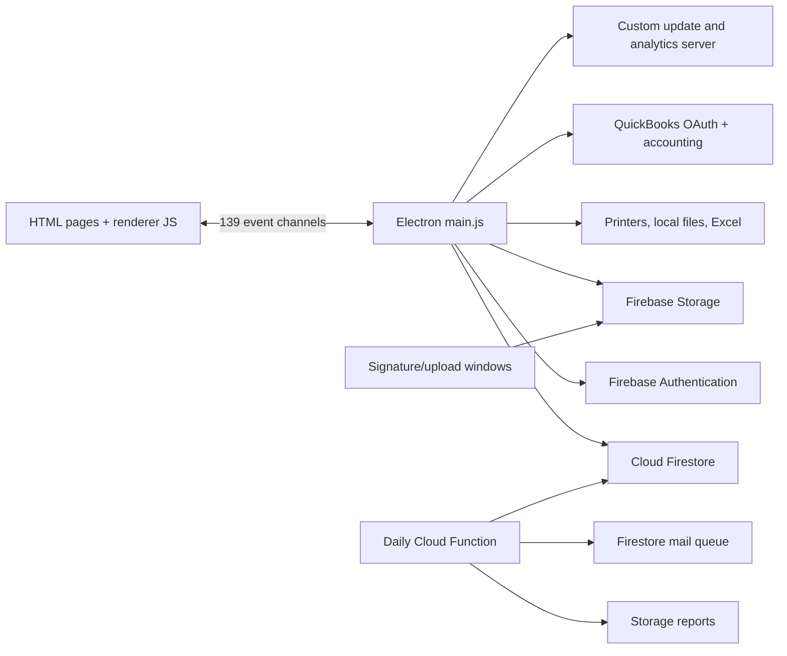

# Existing CERMS system map

**Subsequent read-only verification:** After the user reauthenticated, the Firebase CLI confirmed `cerms-7af24/(default)` is Standard edition in `nam5` and returned the existing index definitions. The initial inspection limitations below describe the original skeleton review. No deployed rules, configuration, or records were changed. See [the membership connection notes](MEMBERSHIP-READONLY.md).

Reviewed September 16, 2026. This is a source-based inventory of the local CERMS checkout, including its existing uncommitted Cloud Function changes. No production records were queried and no backend or legacy code was modified. Source paths below are relative to the original CERMS project.

## Shape of the application

CERMS 4.0.9 is an Electron desktop application with 21 top-level HTML pages, 22 page/shared JavaScript files, receipt templates, and one scheduled Firebase Cloud Function. `src/main.js` contains 6,478 lines and 139 `ipcMain.on` handlers; renderer JavaScript adds approximately 6,500 lines. Most business logic, database access, window management, reporting, and integrations share the main process.

The manifest specifies Electron `^25.8.2`, Firebase `^10.8.0`, jQuery, Chart.js, date-fns, Excel/XML libraries, and QuickBooks SDKs. HTML pages also load Bootstrap, fonts/icons, and some older Firebase scripts from CDNs. Both Electron Forge and electron-builder are configured, and both npm and Yarn lockfiles exist. The existing `test` script starts the app; `lint` is a placeholder. The legacy `build` command publishes automatically (`--publish always`).

## Workflow inventory

| Area                         | Existing behavior                                                                                                                                                                      | Key source                                                                                                       |
| ---------------------------- | -------------------------------------------------------------------------------------------------------------------------------------------------------------------------------------- | ---------------------------------------------------------------------------------------------------------------- |
| Authentication / club access | Email/password sign-in; `users/{uid}` profile; `access` selects a club's `system` record; reset/verification; logout relaunches the app                                                | `main.js:4183–4295`, `main.js:4431–4574`, `login.html`, `access.html`                                            |
| Home / admissions            | Active visits, rental expiration, waitlist, in/out state, locker/room assignment, renewal and checkout                                                                                 | `main.js:511–558`, `main.js:1197–1297`, `main.js:3832`, `home.js`                                                |
| Memberships                  | Create, search, view, edit, renew, import; membership number and government ID fields; notes; do-not-admit and tag flags; waiver status; member files and signatures                   | `main.js:398–509`, `main.js:3253–3310`, `main.js:3518–3647`, `main.js:5333`, `members.js`, `createmembership.js` |
| Point of sale                | Quick sales and member-linked orders; product selection; taxes and discounts; cash/card/gift-card tender; return/void handling; suspended orders; membership/rental side effects       | `main.js:716–842`, `main.js:1105–1195`, `order.js`                                                               |
| Registers                    | Open/close drawers; shift selection; starting/current balances; denomination counts; cash drops; payout/card tracking; receipt and reconciliation reports                              | `main.js:1343–1644`, `register.js`                                                                               |
| Catalog                      | Categories; prices; inventory/par/warnings; core/restricted products; barcodes; images; membership and rental durations; discounts and payout/ask-for-price flags                      | `main.js:572–714`, `main.js:3310–3500`, `products.js`                                                            |
| History                      | Visit and order lookups by member/date/ID; receipt reprints; transaction void/deletion permission                                                                                      | `main.js:3671–3686`, `main.js:3802–3830`, `main.js:5224–5331`, `history.js`                                      |
| Analytics / reports          | Date-range member/activity/order analysis; local Excel reports; register receipts; final reports; accounting invoice grouping                                                          | `main.js:1647–3251`, `main.js:4575`, `analytics.js`                                                              |
| Staff / settings             | Rank and individual permission flags; user creation/edit/removal; business info; waiver/receipt templates; tax rates; shifts; register feature flag; report directories; notifications | `main.js:4258`, `main.js:5017–5105`, `main.js:6033–6300`, `account.js`                                           |
| Messaging                    | Staff chat documents and message subcollections; expiring system announcements. Staff chat link is commented out in shared navigation                                                  | `main.js:4089–4173`, `main.js:4397`, `main.js:6420–6478`, `messages.js`, `core.js:19`                            |
| Events                       | Calendar UI and month navigation. “Add event” only prompts and alerts; no persisted event collection/workflow was found. Link is commented out                                         | `events.js`, `core.js:20`                                                                                        |
| Support / updates            | External support form with context; changelog; manual/custom updater; installation/open analytics                                                                                      | `main.js:6302`, `main.js:6386`, `support.js`, `autoupdater.js`                                                   |

`src/` is omitted from main.js references; page JavaScript is under `src/js/`. Line references describe the reviewed working tree, not a future release.

## Backend and record contract

Firestore is used through the Firebase client SDK in the desktop and Admin SDK in the scheduled function. The desktop calls `getFirestore(firebaseApp)` without a database ID, indicating the **default database** in its configured Firebase project. Database edition, deployed rules, composite indexes, document counts, and actual field variants could not be verified: the local Firebase CLI returned expired credentials. No Firestore/Storage rule or index source files were found in this checkout; `firebase/firebase.json` configures Functions only.

Most business collections contain `access`, a club identifier. `users/{uid}.access` selects `system/{access}` and scopes many queries. Some helpers allow unscoped reads, and ID-based reads do not automatically re-check club ownership. Actual enforcement depends on deployed rules; client filtering is not an authorization boundary.

| Collection / path                  | Observed fields and relationships                                                                                                                                                                                                       | Compatibility notes                                                                                                                                                                                                                                                                                            |
| ---------------------------------- | --------------------------------------------------------------------------------------------------------------------------------------------------------------------------------------------------------------------------------------- | -------------------------------------------------------------------------------------------------------------------------------------------------------------------------------------------------------------------------------------------------------------------------------------------------------------- |
| `users/{authUid}`                  | `email`, `displayName`, `rank`, `access`, `permission*`, `lastRegister`, `version`, `darkMode`, notification preferences                                                                                                                | Existing Firebase Auth UID is the key. Rank comparisons can use strings, e.g. `"1"`.                                                                                                                                                                                                                           |
| `system/{access}`                  | `lid`, business info, receipt/waiver templates, `registerSystem`, `taxRate`, `quickbooksSystem`, `quickBooksToken`, `quickBooksToken2`, file-save paths, shifts, feature flags                                                          | Club configuration, membership-number counter, and integration credentials share one document. Do not expose this entire record in a new settings DTO.                                                                                                                                                         |
| `members/{autoId}`                 | `access`, `id_number`, `name`, `fname`, `lname`, `mname`, `suffix`, `dob`, `idnum`, `idstate`, `email`, `membership_type`, `id_expiration`, `creation_time`, `dna`, `tag`, `waiver_status`, `checkedIn`, `notes`, file/signature fields | Firestore ID differs from human member number. Expiration is Unix seconds; creation is a Firestore Timestamp. Notes can be an old string or an array. `checkedIn` is written at creation; active activity records drive the visit UI.                                                                          |
| `activity/{autoId}`                | `access`, `memberID`, `active`, `goingInactive`, `currIn`, `waitlist`, `lockerRoomStatus`, `notes`, `timeIn`, `timeOut`, sometimes `removed`                                                                                            | Member ID is a string reference. `lockerRoomStatus` is positional: `[enabled, location, rentalName, staffUid, startedUnixSeconds, expiresUnixSeconds]`. `timeIn`/`timeOut` are Timestamp/null.                                                                                                                 |
| `categories/{autoId}`              | `access`, `name`, `desc`, `color`                                                                                                                                                                                                       | Referenced by product `cat`.                                                                                                                                                                                                                                                                                   |
| `products/{autoId}`                | `access`, `cat`, `name`, `price`, `inventory`, `inventoryPar`, `invWarning`, barcode/image data, `taxable`, `active`, `core`, `rental`, `membership`, duration fields, restrictions, payout/ask-for-price                               | Duration is seconds plus raw value/unit. Inventory may be disabled/false. Form inputs can introduce strings. Rental and membership workflows also link by product name.                                                                                                                                        |
| `discounts/{autoId}`               | `access`, `code`, `dollar`, `percent`, `amount`, `asCheck`, `asPro`, `expires`, `typeProduct`, `typeOrder`, `limit`, `used`                                                                                                             | Mixed optional/false/numeric conventions need fixture verification.                                                                                                                                                                                                                                            |
| `orders/{autoId}`                  | `access`, `customerID`, `products`, `discounts`, `total`, `paymentMethod`, `cashier`, `timestamp`, `shift`, `return`, accounting/receipt data                                                                                           | Guest `customerID` can be numeric `0`; otherwise member ID. `products` is an array of product IDs, with repeated IDs representing quantity in report logic. `total = [subtotal, tax, total, originalTotal]`; `paymentMethod = [creditCard, giftCard, cash]`. Discounts can be an array or the string `return`. |
| `registers/{autoId}`               | `access`, `active`, `uid`, `uname`, `timestampStart`, `timestampEnd`, `starting`, `ending`, `shift`, `ccard`, `gcard`, drops, payouts, denomination inputs, `qbinvoice`, returns                                                        | Despite its name, `starting` is updated as cash transactions happen. Reports depend on these existing meanings.                                                                                                                                                                                                |
| `drops/{autoId}`                   | `access`, `registerID`, `timestamp`, `user`, `dropAmt`, denomination fields (`dinput*`), payout/card fields                                                                                                                             | References the register and staff UID.                                                                                                                                                                                                                                                                         |
| `chats/{autoId}`                   | `access`, `participants`, `createdAt`                                                                                                                                                                                                   | Contains staff UID pairs.                                                                                                                                                                                                                                                                                      |
| `chats/{chatId}/messages/{autoId}` | `access`, `senderId`, `message`, `timestamp`                                                                                                                                                                                            | Distinct from top-level announcements.                                                                                                                                                                                                                                                                         |
| `messages/{id}`                    | `message`, `type`, `expire`, optional `version`, optional `access` array                                                                                                                                                                | Global/targeted announcements queried by expiry, then filtered by version/club in client code.                                                                                                                                                                                                                 |
| `mail/{autoId}`                    | `access`, `to`, `message: { subject, text, html }`; report attachments                                                                                                                                                                  | Outbound mail queue. The mail-delivery consumer/extension configuration is not in this checkout.                                                                                                                                                                                                               |

There is also a `register` (singular) write inside a **commented-out** block in `endRegister`; it is not evidence of an active additional collection.

### Storage and local artifacts

- `product-images/`: product images (`uploadimage.js`); some uploads use the original filename.
- `member-files/`: attachments (`uploadfile.js`); filenames include member ID.
- `member-signature-pdfs/{access}/{memberId}.pdf`: signed waiver PDFs (`swf.js`). Signature workflows also reference external signing resources and Topaz SigWeb hardware scripts.
- `reports/{date}_Daily_Register_Report_{access}.xlsx`: scheduled reports in Storage.
- Local `userData` receipt HTML and debug logs; user-selected report output directories; local Excel files.

Preserve these paths and attachment references. Inventory additional legacy file/signature variants using sanitized samples before rebuilding upload/delete operations.

## Daily report function

`firebase/functions/index.js` exports `generateDailyRegisterReport`. It runs at 07:00 America/Chicago, computes the previous local calendar day's boundaries, queries scoped orders and closed registers, looks up cashier/member/product/category data with per-run caches, builds Excel worksheets, uploads the report, makes the object public, and adds a mail-queue document for configured managers. The two club configurations and category aliases are currently hardcoded. Node 22 is declared for Functions.

Compatibility must include original totals/tender positions, repeated product IDs, club scoping, category aliases, register fields, and the reporting timezone. The function presently skips the club if there are no orders, even if registers may have closed. Public report URLs and retries/mail duplication should be reviewed before extending this job. This function has local user edits and was not changed.

## Priority findings

These are code observations and risks, not a claim that deployed rules are insecure or that any compromise occurred.

| Priority | Finding / evidence                                                                                                                                                                                  | Rewrite consequence                                                                                                                                                                       |
| -------- | --------------------------------------------------------------------------------------------------------------------------------------------------------------------------------------------------- | ----------------------------------------------------------------------------------------------------------------------------------------------------------------------------------------- |
| High     | Most windows set `nodeIntegration: true`, `contextIsolation: false` (`main.js:4651` onward); renderer pages use `innerHTML` and remote scripts                                                      | Bundle scripts, isolate/sandbox the renderer, render record text through React, and expose only specific desktop operations.                                                              |
| High     | `completeOrder` updates discounts, register totals, order records, membership/rental records, and inventory separately, using timers and delays (`1105–1195`)                                       | Partial completion and repeated submissions can diverge. Design transactional/idempotent checkout before enabling writes.                                                                 |
| High     | `getNewID`/membership creation use a shared `system.lid` counter with query/check/increment sequencing (`3502`, `3518`, `4527`)                                                                     | Concurrent clients can race. Transactional allocation must preserve existing numbers and paths; mixed-version writers need rollout coordination.                                          |
| High     | New staff accounts use a fixed initial password, change the active client auth session, then re-authenticate with retained operator credentials (`4258`)                                            | Replace with a trusted administrative workflow; retain existing Auth users and profile documents.                                                                                         |
| High     | The custom update endpoint can trigger a local self-delete routine and supplies installer download URLs (`autoupdater.js`)                                                                          | Do not port this updater. Use signed release artifacts and a reviewed update channel later.                                                                                               |
| High     | QuickBooks OAuth configuration is imported into the desktop, tokens are stored on the club system record, OAuth state is constant, and redirect handling matches HTTP (`main.js:4723`, `5779–5880`) | Inspect actual credential exposure and rules, move confidential integration operations to a trusted boundary, retain accounting compatibility. Do not copy old secrets into the skeleton. |
| Medium   | Snapshot unsubscribe handles are local and discarded; message subscriptions grow per chat; ID lists and row-data arrays are maintained separately (`3689–4173`)                                     | Make subscriptions owned by the current session/view, clean up on logout, and use keyed caches.                                                                                           |
| Medium   | Startup subscribes to many domains before opening Home; active visits fetch members individually; order listener is limited without timestamp ordering (`4057`, `4299`)                             | Load per screen, use cursor pages and targeted subscriptions, batch/cache joins, and order queries explicitly.                                                                            |
| Medium   | Money totals are mutable numeric arrays and cash totals use read/modify/write (`1559`)                                                                                                              | Use named in-memory objects and exact arithmetic; serialize back into the unchanged legacy format after parity tests.                                                                     |
| Medium   | UI and handlers use inconsistent permission checks; some ID reads are unscoped; server rules are absent from the repo                                                                               | Verify deployed rules and negative access tests before real data access. Preserve existing permission names.                                                                              |
| Medium   | `querySnapshot3` is referenced but undefined in membership import (`3571`); product creation defines `taxable` twice (`642`); `addLockerRoom` has a detached `+10000` expression (`1290`)           | Rebuild and test the intended behavior instead of copying these paths.                                                                                                                    |
| Medium   | Report generation consumes a large part of main.js, with sequential lookups and local Excel work                                                                                                    | Separate reporting services and consider workers for expensive processing once measured.                                                                                                  |

## Unverified items to resolve later

Deployed database edition/rules/indexes; production document sizes and variants; all roles and actual permissions; current printer/card-terminal/signature hardware; mail extension configuration; exact receipt/accounting reconciliation requirements; OS deployment targets and signing identity; interactions with sibling online/admin apps. Only CERMS and the new empty CERMS-5.0 directory were within this analysis scope. Payment fields establish tender recording, not proof of integrated card processing.
